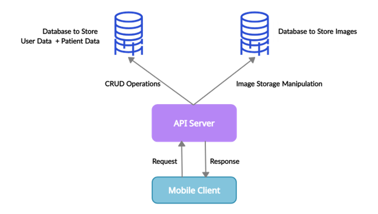
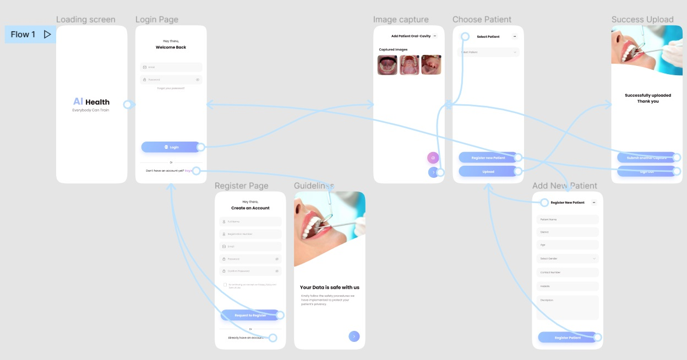

# Image Data Handling System for Research

 

## Team
-  E/18/073 - Dhananjaya W.M.T.   [e18073@eng.pdn.ac.lk](mailto:e18073@eng.pdn.ac.lk)
-  E/18/214 - Manahara H.K.       [e18214@eng.pdn.ac.lk](mailto:e18214@eng.pdn.ac.lk)
-  E/18/282 - Ranasinghe R.A.N.S. [e18282@eng.pdn.ac.lk](mailto:e18282@eng.pdn.ac.lk)

## Table of Contents
1. [Introduction](#introduction)
2. [Solution Architecture](#solution-architecture )
3. [User Interface Design](#user-interface-design)
4. [Links](#links)

---

## Introduction

In this project, we develop a mobile application that can be used to capture and upload images of the oral cavity. This will mainly serve the roles of the admin to accept user requests and the doctor to capture the oral cavity images and upload them along with the patient's details. 

### Purpose of Our Project

This is a support system for the project of building an AI-based web application for Oral Cavity Detection which is done by a team of E17 undergraduates.
An AI-based tool needs a lot of images to train the model. But, A web-based application doesn't provide a convenient method for the doctors to capture the photographs of the oral cavities and upload them forthwith. This mobile application will be a solution to the aforementioned issue.

## Solution Architecture

## User Interface Design

The mobile application comprises of following features.
    
1. User Login for both doctors and admis
    
2. Signup for Doctors
    
3. Image Capturing
    
4. Image + Patient Details Uploading 
    

See the prototype of our mobile interface [here](https://www.figma.com/proto/p9qO6wqmA3O3c4vEa0SeVJ/AI-Health?node-id=808%3A2710&scaling=scale-down&page-id=206%3A281&starting-point-node-id=808%3A2705)

**Wire frame Diagram**

.....

## Links

- [Project Repository]([https://github.com/cepdnaclk](https://github.com/cepdnaclk/e18-co227-Image-Data-Handling-System-for-Research-Group-B)/{{ page.repository-name }}){:target="_blank"}
- [Project Page](https://cepdnaclk.github.io/e18-co227-Image-Data-Handling-System-for-Research-Group-B){:target="_blank"}
- [Department of Computer Engineering](http://www.ce.pdn.ac.lk/)
- [University of Peradeniya](https://eng.pdn.ac.lk/)

[//]: # (Please refer this to learn more about Markdown syntax)
[//]: # (https://github.com/adam-p/markdown-here/wiki/Markdown-Cheatsheet)
