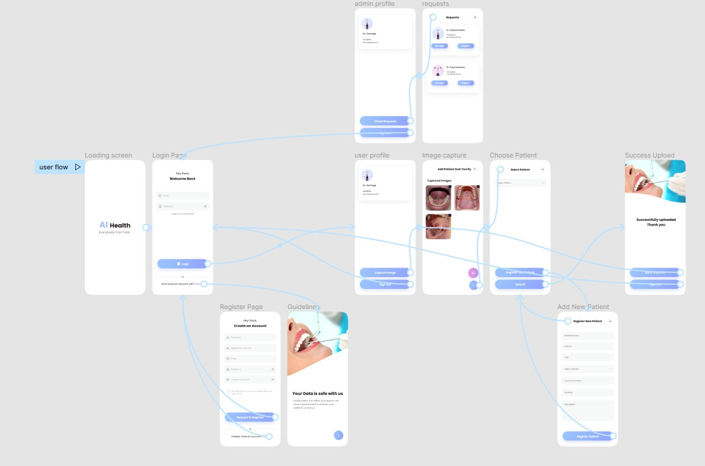

# Image Data Handling System for Research

## User Interface

The Front end of this mobile application is built using React Native.

The mobile application comprises of following features.
    
1. User Login for both doctors and admis
2. Signup for Doctors
3. User Account Page for Doctors
4. Request Accept Page for Admins
5. Image Capturing
6. Image + Patient Details Uploading 

See the prototype of our mobile interface [here](https://www.figma.com/proto/p9qO6wqmA3O3c4vEa0SeVJ/AI-Health?node-id=808%3A2710&scaling=scale-down&page-id=206%3A281&starting-point-node-id=808%3A2705)

**Wire frame Diagram**

