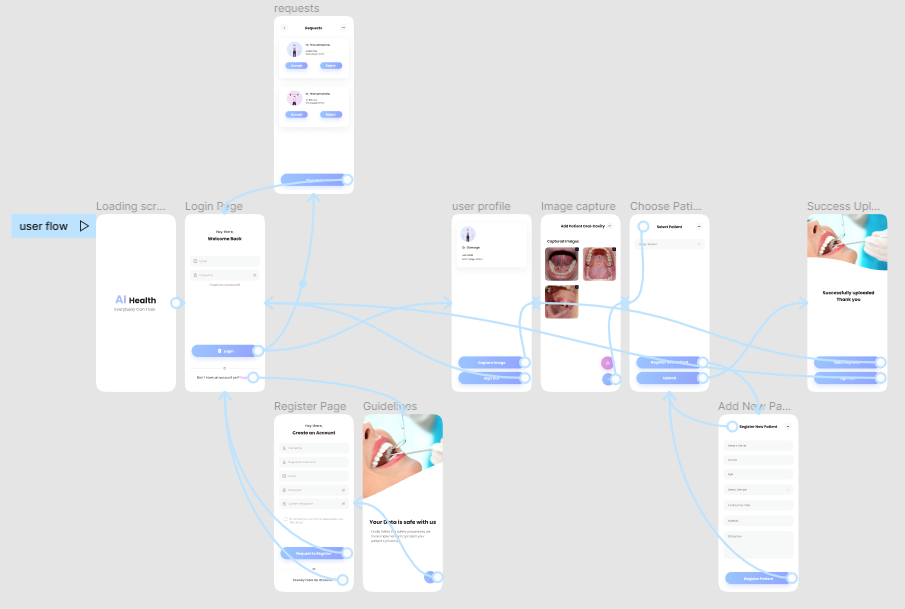

# Image Data Handling System for Research

## User Interface

The Front end of this mobile application is built using React Native and it comprises of following screens.

User Login and Signup Pages

  &emsp;
  &emsp;

When logged in as an admin,

  &emsp;
  &emsp;

When logged in as a doctor,

  &emsp;
  &emsp;
  &emsp;
  &emsp;
</p

See the prototype of our mobile interface [here](https://www.figma.com/proto/p9qO6wqmA3O3c4vEa0SeVJ/AI-Health?node-id=808%3A2710&scaling=scale-down&page-id=206%3A281&starting-point-node-id=808%3A2705)

**Wire frame Diagram**

Enhancing user experince is a good quality of a mobile application. Here's how we have done it in our app.

#### Offer great UI design
1) Make it simple and attractive.

2) Make it user friendly
- Manage layout when keyboard is visible, Having placeholders in all text inputs, Issue alert messages whenever there is an unusual behavior

#### Available for both iOS and android users

#### Prioritize Security
1) Use json web token system to ensure authorization.
2) Passwords will be encrypted.
3) Sensitive image metadata like patients' personal details will be stored safely with strict and limited access.

#### Including image pre-processor tools
- Issue warnings when camera quality is low
- Only allowing to store the images of accepted quality
- Allow image edit facility before uploading

